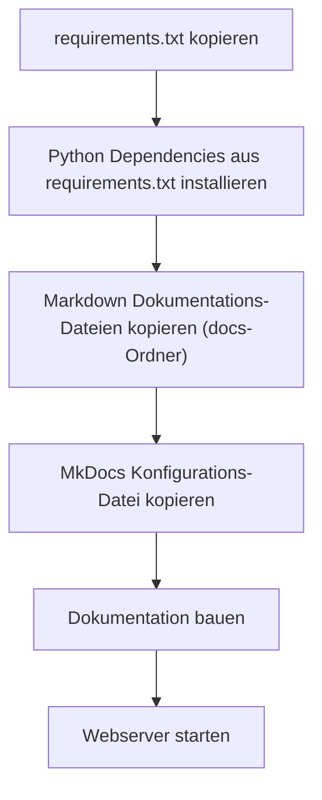

# Docker

## Image-Varianten

Das Docker Image wird in zwei unterschiedlichen Varianten angeboten, in beiden Varianten wird die Dokumentation als Webserver bereitgestellt. Auch die Funktionalitäten in der Web-Version (z.B. selbstständiges sortieren von Tabellen, gerenderte Mermaid-Diagramme, etc.) unterscheiden sich nicht. Der große Unterschied ist die Generierung einer PDF aus der kompletten Dokumentation, diese ist über den Webserver abrufbar.  
Für die PDF-Generierung sind eine Anzahl an zusätzlichen RPM- und Python-Paketen notwendig, dies führt zu einem größeren Image (*~170* MB vs. *~765* MB).  
Wenn eine PDF nicht notwendig ist, sollte das *slim*-Image verwendet werden.

Variante | Größe
-------- | -----
slim     | ~170 MB
pdf      | ~765 MB

### *Slim*-Variante

Die folgende Container-Definition wird für die *Slim*-Variante verwendet:

```dockerfile
FROM python:3.8-slim

WORKDIR /tmp

# Copy Python packages/dependencies file
COPY dockerfiles/slim/requirements.txt .

# Update pip and install Python dependencies
RUN python3 -m pip install --no-cache-dir -U pip
RUN python3 -m pip install --no-cache-dir -r requirements.txt

# Copy documentation source files to working directory
COPY docs docs
COPY dockerfiles/slim/mkdocs.yml .

# Build new documentation
RUN mkdocs build

EXPOSE 80

# Run webserver
CMD python -m http.server 80 -d site/
```

Die verwendeten Python-Pakete in der `requirements.txt`

```python
mkdocs
mkdocs-material==7.3.6
mkdocs-autolinks-plugin
mkdocs-awesome-pages-plugin
mkdocs-mermaid2-plugin
```

Das Docker Image muss mit der aktuellsten Version der Dokumentation gebaut werden:
```bash
docker build -t documentation:slim -f dockerfiles/slim/Dockerfile .
```

Container aus aktuellem Image starten, der Webserver wird hier auf Port 8080 verfügbar gemacht:
```bash
docker run -d -p 8080:80/tcp --name docs documentation:slim
```

### *PDF*-Variante

Die folgende Container-Definition wird für die *PDF*-Variante verwendet:

```dockerfile
FROM python:3.8-slim

WORKDIR /tmp

# Copy Python packages/dependencies file
COPY dockerfiles/pdf/requirements.txt .

# Install package dependencies and clean up afterwards
RUN apt-get update \
 && apt-get install --no-install-recommends -y python3-cffi python3-brotli libpango-1.0-0 libpangoft2-1.0-0 chromium\
 && apt-get autoremove \
 && apt-get clean \
 && rm -rf /var/lib/apt/lists/*

# Update pip and install Python dependencies
RUN python3 -m pip install --no-cache-dir -U pip
RUN python3 -m pip install --no-cache-dir -r requirements.txt

# Copy documentation source files to working directory
COPY docs docs
COPY dockerfiles/pdf/mkdocs.yml .

# Build new documentation
RUN ENABLE_PDF_EXPORT=1 mkdocs build

EXPOSE 80

# Run webserver
CMD python -m http.server 80 -d site/
```

Die verwendeten Python-Pakete in der `requirements.txt`

```python
beautifulsoup4==4.9.3
mkdocs
mkdocs-material==7.3.6
mkdocs-autolinks-plugin
mkdocs-awesome-pages-plugin
mkdocs-mermaid2-plugin
mkdocs-with-pdf
```

Die *PDF*-Variante wird **mit** PDF-Generierung realisiert.

Das Docker Image muss mit der aktuellsten Version der Dokumentation gebaut werden:
```bash
docker build -t documentation:pdf -f dockerfiles/pdf/Dockerfile .
```

Container aus aktuellem Image starten, der Webserver wird hier auf Port 8080 verfügbar gemacht:
```bash
docker run -d -p 8080:80/tcp --name docs documentation:pdf
```

## Build Prozess

Das folgende Diagram zeigt den Prozess zur Erstellung eine neuen Container-Images mit der aktuellsten Dokumentation:


